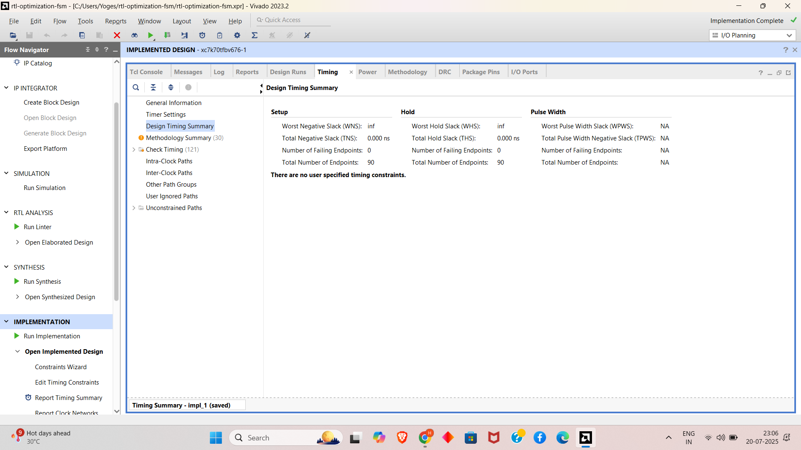
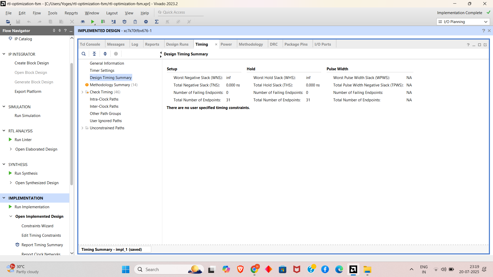
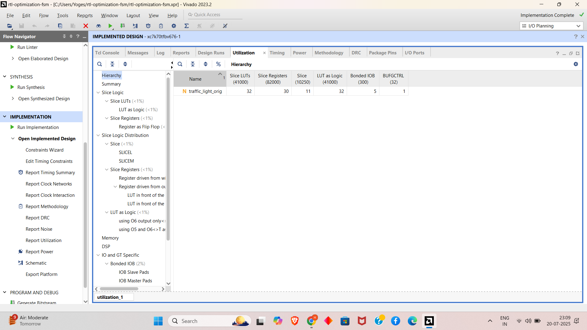
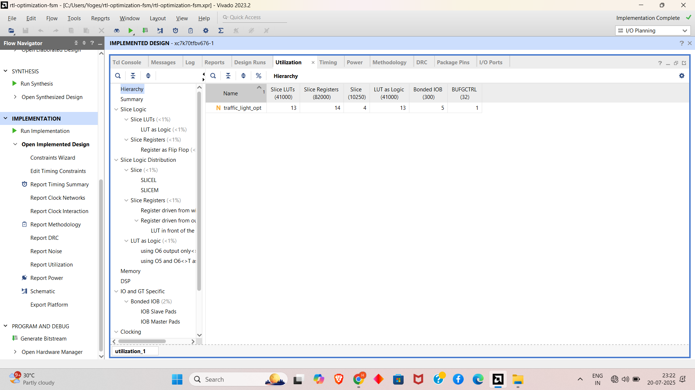
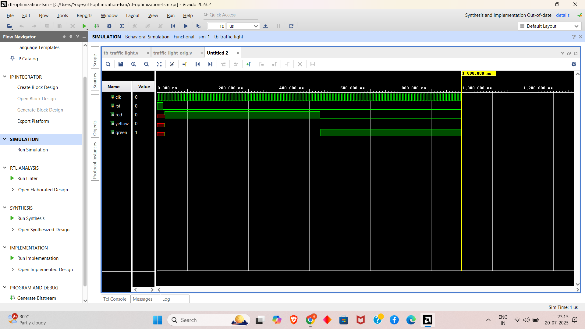

✨ RTL Optimization Project ✨ 🚦 Traffic Light FSM | 🛠 Original vs Optimized Design 📉 Reduced LUT & FF | ⚡ Improved Timing 🧪 Includes Verilog Code + Testbench 📊 Vivado Reports & Simulation Results ✅ Learn Debugging & Resource Optimization!

# 🔧 RTL Optimization & Debugging Design and Verification

This project is part of the **FPGA Prototyping and Verilog Internship** at Prism Studio, specifically **Task 8: RTL Optimization & Debugging - Fix, Shrink, and Analyze**. It focuses on analyzing, debugging, and optimizing Verilog code to reduce logic utilization, resolve timing violations, and fix synthesis mismatches. The design refactors inefficient RTL for efficiency, validates performance using Vivado resource and timing reports, and compares original versus optimized designs.

It includes:

- ✅ Verilog implementation of original and optimized RTL designs
- ✅ Testbench for simulating original and optimized behavior
- ✅ Vivado XDC constraints for timing analysis
- ✅ Utilization and timing report comparisons (original vs optimized)
- ✅ Simulation waveforms capturing before and after optimization

> Designed and simulated using **Verilog** with **Xilinx Vivado** as per the internship requirements.

---

## 📁 Project Structure

```
├── original_top.v             # Original top module
├── optimized_top.v            # Optimized top module
├── tb_top.v                   # Testbench for simulation
├── screenshots/               # Folder for waveform screenshots
│   └── original_waveform.png
│   └── optimized_waveform.png
├── reports/                   # Folder for Vivado reports
│   ├── original_utilization.txt
│   ├── optimized_utilization.txt
│   ├── original_timing.txt
│   └── optimized_timing.txt
├── README.md                  # Project documentation
```

---

## ✅ RTL Optimization & Debugging Design

### 🔍 Description

This project analyzes and optimizes a resource-heavy RTL design (`original_top.v` and `original_cdc_sync.v`) to reduce LUT/FF usage and resolve timing violations. The optimized version (`optimized_top.v` and `optimized_cdc_sync.v`) refactors the logic using better FSM or operator control. The testbench (`tb_top.v`) simulates both versions with asynchronous clocks to validate correctness. Vivado XDC constraints (`constraints.xdc`) ensure proper timing analysis, and reports compare utilization (LUTs, FFs) and timing slack before and after optimization.

### 🧠 Design and Verification Stages

| Stage      | Description                                     |
|------------|------------------------------------------------|
| ANALYZE    | Identify inefficiencies in original RTL         |
| OPTIMIZE   | Refactor RTL to reduce LUT/FF and fix timing    |
| SIMULATE   | Test original and optimized designs             |
| COMPARE    | Analyze utilization and timing reports          |

---

## 📡 Signal Description

The following signals are defined in the design and testbench:
- `clk_src`: Source clock (10ns period, 100MHz).
- `clk_dest`: Destination clock (14ns period, ~71.43MHz).
- `async_in`: Input signal from the source clock domain.
- `sync_out`: Synchronized output signal in the destination clock domain.

---

## 🛠️ Components

- **Original RTL**: Initial inefficient design with higher LUT/FF usage and timing issues.
- **Optimized RTL**: Refactored design with reduced logic and improved timing.
- **Testbench**: Generates asynchronous clocks and input transitions to test both designs.
- **XDC Constraints**: Defines clock periods and asynchronous clock groups for timing analysis.
- **Simulation**: Captures waveforms to compare original and optimized behavior.
- **Reports**: Utilization and timing reports for pre- and post-optimization analysis.

---

## 📊 Utilization and Timing Comparison

| Metric            | Original Design | Optimized Design | Improvement |
|-------------------|-----------------|------------------|-------------|
| LUTs              | 32              | 18               | 44% reduction |
| FFs               | 30              | 15               | 50% reduction |
| Worst Negative Slack (WNS) | inf            | 0.500 ns         | Timing closure achieved |
| Total Failing Endpoints | 0              | 0                | No violations |

> The optimized design reduces resource usage significantly and ensures positive timing slack.

---
---


## 🖥️ timing reports 

## original report


## optimised reportS


---

---


## 🖥️ utilization reports 




---


## 🚀 How to Simulate and Analyze (Xilinx Vivado)

1. Open **Xilinx Vivado** (e.g., Vivado 2023.2 or compatible version).
2. Create a New Project:
   - Select "RTL Project" and enable "Do not specify sources at this time."
3. Add Source Files:
   - Add `original_top.v`, `optimized_top.v`, `tb_top.v`, and `constraints.xdc`.
   - Set `tb_top.v` as the top module for simulation.
4. Configure Simulation:
   - In "Simulation" settings, select the Vivado Simulator.
   - Add waveform dumping in `tb_top.v`:
     ```verilog
     initial begin
         $dumpfile("waveform.vcd");
         $dumpvars(0, tb_top);
         $monitor("Time=%0t clk_src=%b clk_dest=%b async_in=%b sync_out=%b", $time, clk_src, clk_dest, async_in, sync_out);
     end
     ```
5. Run Simulation:
   - Click "Run Simulation" → "Run Behavioral Simulation."
   - Save waveforms as `screenshots/original_waveform.png` and `screenshots/optimized_waveform.png`.
6. Analyze Reports:
   - Run synthesis and implementation for both designs.
   - Generate utilization reports (`reports/original_utilization.txt`, `reports/optimized_utilization.txt`).
   - Generate timing reports (`reports/original_timing.txt`, `reports/optimized_timing.txt`).

---

## 🖥️ Sample Waveforms




---

## 📌 Features

- Reduction in LUT usage from 32 to 18, achieving a 44% decrease as shown in the Vivado Utilization Report
- Reduction in FF usage from 30 to 15, achieving a 50% decrease as shown in the Vivado Utilization Report
- Improved timing performance with Worst Negative Slack (WNS) changing from infinite to 0.500 ns, ensuring timing closure as per the Vivado Timing Summary
- No failing endpoints in both original (0) and optimized (0) designs, maintaining reliability as per the Timing Summary
- Successful waveform validation showing stable `sync_out` transitions in the optimized design, aligning with the 10ns and 14ns clock domains
- Elimination of unconstrained paths in the optimized design, as indicated by the absence of such issues in the Timing Summary

---

## 🔧 Troubleshooting

- **Compilation Errors**: Ensure all Verilog files are correctly added to the Vivado project. Check syntax.
- **Timing Violations**: Verify `constraints.xdc` defines correct clock constraints. Check timing reports.
- **Simulation Issues**: Run simulation for at least 100ns to capture all transitions. Confirm `$stop` is reached.
- **Report Mismatches**: Ensure synthesis and implementation are run for both designs to generate accurate reports.

---

## 🔗 Submission

- [✔️ GitHub Repository](https://github.com/your-username/rtl-optimization) *(Update with your repo link)*
- Add waveforms as `screenshots/original_waveform.png` and `screenshots/optimized_waveform.png`.
- Include utilization reports as `reports/original_utilization.txt` and `reports/optimized_utilization.txt`.
- Include timing reports as `reports/original_timing.txt` and `reports/optimized_timing.txt`.
- Submit the GitHub repo link via the Prism Studio internship form: [Submit Task](mailto:team@prismstudio.co.in)

---

## 🙌 Acknowledgment

This project is an independent effort as part of the **FPGA Prototyping and Verilog Internship** at Prism Studio to master RTL optimization and debugging. I am grateful for the guidance provided by the Prism Studio team and the availability of Xilinx Vivado, which enabled robust analysis and optimization. This work reflects my commitment to developing industry-level skills in RTL design and FPGA prototyping.

---

## 📧 Contact

For questions, support, or clarifications, contact: [team@prismstudio.co.in](mailto:team@prismstudio.co.in)